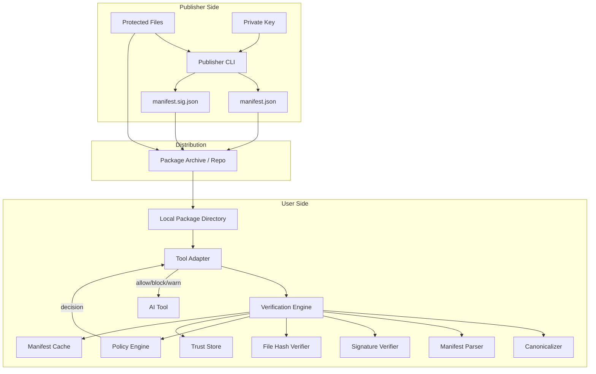
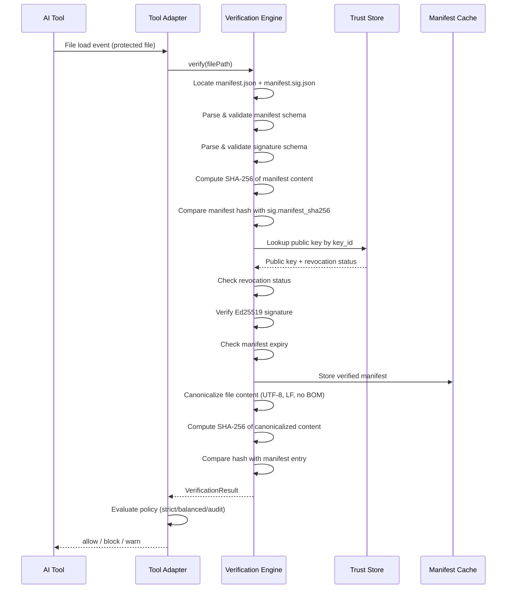

# Design Document: ContextLock

## Overview

ContextLock is a Trusted Content Verification (TCV) plugin system that verifies the authenticity and integrity of text-based project artifacts before AI coding tools load or interpret them. The system uses Ed25519 digital signatures and SHA-256 cryptographic hashes with a signed manifest model to establish a chain of trust from publisher to user.

The architecture follows a monorepo structure with five packages:

- **core** — Shared verification engine: canonicalization, hashing, manifest parsing, signature verification, policy evaluation
- **cli-publisher** — Publisher-facing CLI for key generation, manifest building, signing, and pre-publish verification
- **cli-user** — User-facing CLI for trust management, file verification, cache management, and key fingerprint display
- **adapter-claude-code** — Claude Code integration adapter
- **adapter-openclaw** — OpenClaw integration adapter

The core engine is tool-agnostic. Adapters intercept file load events, invoke the core engine, and enforce policy decisions.

### Key Design Decisions

1. **Detached signatures** — Manifest (`manifest.json`) and signature (`manifest.sig.json`) are separate files for simplicity and independent tooling.
2. **Sidecar manifest model (Model A first)** — Manifests live alongside protected files in the package directory.
3. **Explicit trust only** — Public keys must be pinned manually; no auto-trust from URLs, repos, or package names.
4. **Canonicalization before hashing** — UTF-8, LF newlines, no BOM. This prevents cross-platform false mismatches.
5. **Policy engine with three levels** — strict, balanced, audit — configurable per-publisher.
6. **Filename hash mode as advisory** — Lightweight integrity check that never grants `trusted` status.

## Architecture



### Verification Flow Sequence



## Components and Interfaces

### 1. Canonicalizer (`core/canonicalize.ts`)

Normalizes file content before hashing.

```typescript
interface CanonicalizerOptions {
  stripBom: boolean;       // default: true
  normalizeLineEndings: boolean; // default: true (to LF)
}

function canonicalize(content: Buffer): Buffer;
```

**Behavior:**
- Strips UTF-8 BOM (0xEF 0xBB 0xBF) if present
- Converts CRLF (`\r\n`) and CR (`\r`) to LF (`\n`)
- Returns canonicalized UTF-8 bytes

### 2. Hasher (`core/hash.ts`)

Computes SHA-256 hashes.

```typescript
function sha256(data: Buffer): string;        // returns lowercase hex
function sha256Bytes(data: Buffer): Buffer;    // returns raw bytes
function computeFileHash(filePath: string): Promise<string>;
function computeFingerprint(publicKey: Buffer): string;
```

### 3. Manifest Parser (`core/manifest.ts`)

Parses and validates manifest and signature JSON documents.

```typescript
interface ManifestFileEntry {
  path: string;
  sha256: string;
  size: number;
  media_type?: string;
}

interface Manifest {
  schema: "tcv-manifest/v1";
  package: string;
  version: string;
  publisher: {
    name: string;
    key_id: string;
    public_key_fingerprint: string;
  };
  published_at: string;
  expires_at?: string;
  source?: {
    repository?: string;
    release?: string;
  };
  files: ManifestFileEntry[];
  revocation?: {
    status: string;
    url?: string;
  };
}

interface DetachedSignature {
  schema: "tcv-signature/v1";
  manifest_sha256: string;
  algorithm: "Ed25519";
  key_id: string;
  signature: string; // base64url
}

function parseManifest(json: string): Manifest;
function serializeManifest(manifest: Manifest): string;
function parseSignature(json: string): DetachedSignature;
function serializeSignature(sig: DetachedSignature): string;
function validateManifest(manifest: Manifest): ValidationError[];
function validateSignature(sig: DetachedSignature): ValidationError[];
```

**Validation rules:**
- Schema field must match expected version
- All file entries must have `path`, `sha256`, `size`
- No duplicate file paths
- `published_at` must be valid ISO 8601
- `expires_at` if present must be valid ISO 8601 and after `published_at`

### 4. Signature Verifier (`core/signature.ts`)

Verifies Ed25519 signatures against the trust store.

```typescript
interface SignatureVerificationInput {
  manifestContent: Buffer;       // raw manifest bytes
  signature: DetachedSignature;
  trustStore: TrustStore;
}

interface SignatureVerificationOutput {
  valid: boolean;
  reason?: string;
  keyId?: string;
  publisher?: string;
}

function verifySignature(input: SignatureVerificationInput): SignatureVerificationOutput;
```

**Steps:**
1. Compute SHA-256 of `manifestContent`
2. Compare with `signature.manifest_sha256`
3. Look up `signature.key_id` in trust store
4. Check key revocation status
5. Verify Ed25519 signature using the public key

### 5. Trust Store (`core/trust-store.ts`)

Manages trusted publisher keys and policies.

```typescript
interface TrustedPublisher {
  publisher: string;
  key_id: string;
  public_key: string;       // base64-encoded Ed25519 public key
  fingerprint: string;       // SHA-256 hex of public key
  revoked: boolean;
  policy: PublisherPolicy;
}

interface PublisherPolicy {
  default_action: "block" | "warn" | "allow";
  allow_expired_manifest: boolean;
  allow_offline_cached_manifest: boolean;
}

interface TrustStoreData {
  schema: "tcv-truststore/v1";
  trusted_publishers: TrustedPublisher[];
}

class TrustStore {
  load(path: string): Promise<void>;
  save(path: string): Promise<void>;
  addPublisher(entry: TrustedPublisher): void;
  removePublisher(keyId: string): void;
  getPublisher(keyId: string): TrustedPublisher | undefined;
  revokeKey(keyId: string): void;
  listPublishers(): TrustedPublisher[];
}
```

### 6. Policy Engine (`core/policy.ts`)

Evaluates verification results against configured policy.

```typescript
type PolicyLevel = "strict" | "balanced" | "audit";

type PolicyDecision = "allow" | "warn" | "block" | "quarantine" | "audit";

interface PolicyInput {
  level: PolicyLevel;
  verificationResult: VerificationResult;
  publisherPolicy?: PublisherPolicy;
}

function evaluatePolicy(input: PolicyInput): PolicyDecision;
```

**Policy matrix:**

| Status     | strict  | balanced | audit |
|------------|---------|----------|-------|
| trusted    | allow   | allow    | allow |
| modified   | block   | block    | audit |
| untrusted  | block   | warn     | audit |
| revoked    | block   | block    | audit |
| expired    | block   | warn     | audit |
| error      | block   | block    | audit |

### 7. Verification Engine (`core/engine.ts`)

Orchestrates the full verification flow.

```typescript
type VerificationStatus = "trusted" | "modified" | "untrusted" | "revoked" | "expired" | "error";

interface VerificationResult {
  status: VerificationStatus;
  publisher?: string;
  keyId?: string;
  manifestSource?: string;
  fileHash?: string;
  expectedHash?: string;
  reason?: string;
  expiresAt?: string;
  warning?: string;
}

interface VerificationEngineConfig {
  trustStorePath: string;
  cachePath: string;
  protectedPatterns: string[];
  policyLevel: PolicyLevel;
}

class VerificationEngine {
  constructor(config: VerificationEngineConfig);
  verify(filePath: string): Promise<VerificationResult>;
  isProtected(filePath: string): boolean;
  verifyManifest(manifestPath: string, signaturePath: string): Promise<VerificationResult>;
}
```

### 8. Manifest Cache (`core/cache.ts`)

Caches verified manifests for offline use.

```typescript
interface CacheEntry {
  manifest: Manifest;
  fetchedAt: string;       // ISO 8601
  expiresAt?: string;      // from manifest
  fingerprint: string;     // key fingerprint used for verification
}

class ManifestCache {
  constructor(cachePath: string);
  get(packageName: string, version: string, fingerprint: string): CacheEntry | undefined;
  put(manifest: Manifest, fingerprint: string): void;
  remove(packageName: string, version: string, fingerprint: string): void;
  refresh(trustStore: TrustStore): Promise<void>;
  listEntries(): CacheEntry[];
}
```

### 9. Protected File Detector (`core/detector.ts`)

Matches file paths against configured glob patterns.

```typescript
const DEFAULT_PATTERNS: string[] = [
  "**/SKILL.md",
  "**/CLAUDE.md",
  "**/RULES.md",
  "**/*.prompt.md",
  "**/*.policy.md",
];

function isProtectedFile(filePath: string, patterns: string[]): boolean;
function findProtectedFiles(directory: string, patterns: string[]): Promise<string[]>;
```

### 10. Filename Hash Extractor (`core/filename-hash.ts`)

Extracts and verifies embedded filename hashes.

```typescript
interface FilenameHashResult {
  hasEmbeddedHash: boolean;
  embeddedHash?: string;
  computedHashPrefix?: string;
  matches?: boolean;
}

function extractFilenameHash(filename: string): string | null;
function verifyFilenameHash(filePath: string): Promise<FilenameHashResult>;
```

### 11. Tool Adapter Interface (`core/adapter.ts`)

Standard interface for tool-specific adapters.

```typescript
interface ToolAdapter {
  onFileLoad(filePath: string): Promise<PolicyDecision>;
  getVerificationStatus(filePath: string): Promise<VerificationResult>;
}
```

### 12. Publisher CLI (`cli-publisher/`)

Commands:
- `init-key [--output <dir>]` — Generate Ed25519 keypair
- `build-manifest <dir> [--patterns <globs>]` — Build manifest.json
- `sign-manifest <manifest> --key <private-key>` — Sign manifest
- `verify <dir>` — Pre-publish verification
- `key-fingerprint <public-key>` — Display fingerprint

### 13. User CLI (`cli-user/`)

Commands:
- `trust add <public-key-file>` — Add trusted publisher
- `trust remove <key-id>` — Remove trusted publisher
- `trust list` — List trusted publishers
- `trust revoke <key-id>` — Revoke a key
- `verify <file>` — Verify a protected file
- `cache refresh` — Re-verify cached manifests
- `key-fingerprint <public-key>` — Display fingerprint

## Data Models

### Manifest Schema (`tcv-manifest/v1`)

```json
{
  "schema": "tcv-manifest/v1",
  "package": "string (required)",
  "version": "string (required, semver)",
  "publisher": {
    "name": "string (required)",
    "key_id": "string (required)",
    "public_key_fingerprint": "string (required, hex)"
  },
  "published_at": "string (required, ISO 8601)",
  "expires_at": "string (optional, ISO 8601)",
  "source": {
    "repository": "string (optional, URL)",
    "release": "string (optional, URL)"
  },
  "files": [
    {
      "path": "string (required, relative)",
      "sha256": "string (required, lowercase hex)",
      "size": "number (required, bytes)",
      "media_type": "string (optional)"
    }
  ],
  "revocation": {
    "status": "string (required: 'active' | 'revoked')",
    "url": "string (optional, URL)"
  }
}
```

### Signature Schema (`tcv-signature/v1`)

```json
{
  "schema": "tcv-signature/v1",
  "manifest_sha256": "string (required, lowercase hex)",
  "algorithm": "Ed25519",
  "key_id": "string (required)",
  "signature": "string (required, base64url)"
}
```

### Trust Store Schema (`tcv-truststore/v1`)

```json
{
  "schema": "tcv-truststore/v1",
  "trusted_publishers": [
    {
      "publisher": "string (required)",
      "key_id": "string (required)",
      "public_key": "string (required, base64)",
      "fingerprint": "string (required, hex)",
      "revoked": "boolean (default: false)",
      "policy": {
        "default_action": "block | warn | allow",
        "allow_expired_manifest": "boolean",
        "allow_offline_cached_manifest": "boolean"
      }
    }
  ]
}
```

### Manifest Cache Entry

```json
{
  "package": "string",
  "version": "string",
  "fingerprint": "string (hex)",
  "manifest": "Manifest object",
  "fetched_at": "string (ISO 8601)",
  "expires_at": "string (ISO 8601, optional)"
}
```

### VerificationResult

```typescript
{
  status: "trusted" | "modified" | "untrusted" | "revoked" | "expired" | "error";
  publisher?: string;
  keyId?: string;
  manifestSource?: string;
  fileHash?: string;
  expectedHash?: string;
  reason?: string;
  expiresAt?: string;
  warning?: string;
}
```

### Protected Patterns Configuration

```json
{
  "protected_patterns": [
    "**/SKILL.md",
    "**/CLAUDE.md",
    "**/RULES.md",
    "**/*.prompt.md",
    "**/*.policy.md"
  ]
}
```


## Correctness Properties

*A property is a characteristic or behavior that should hold true across all valid executions of a system — essentially, a formal statement about what the system should do. Properties serve as the bridge between human-readable specifications and machine-verifiable correctness guarantees.*

### Property 1: Canonicalization idempotence

*For any* file content (with arbitrary line endings and optional BOM), canonicalizing the content and then canonicalizing the result again should produce the same output as the first canonicalization. In other words, `canonicalize(canonicalize(x)) == canonicalize(x)`.

**Validates: Requirements 1.1, 1.2, 1.3**

### Property 2: Cross-platform hash equivalence

*For any* file content string, the SHA-256 hash of the canonicalized content should be identical regardless of whether the original content used LF, CRLF, or CR line endings, and regardless of whether a UTF-8 BOM was present.

**Validates: Requirements 1.4**

### Property 3: Manifest round-trip

*For any* valid Manifest object, serializing it to JSON and then parsing the JSON back should produce an equivalent Manifest object.

**Validates: Requirements 2.5, 13.3**

### Property 4: Detached signature round-trip

*For any* valid DetachedSignature object, serializing it to JSON and then parsing the JSON back should produce an equivalent DetachedSignature object.

**Validates: Requirements 13.4**

### Property 5: Invalid manifest rejection

*For any* JSON object that is missing required fields or has wrong types according to the `tcv-manifest/v1` schema, the manifest parser should return an error status with a descriptive reason.

**Validates: Requirements 2.2**

### Property 6: Sign-then-verify round-trip

*For any* valid manifest content and any Ed25519 keypair, signing the manifest with the private key and then verifying the detached signature with the corresponding public key should succeed. Furthermore, verifying with any different public key should fail.

**Validates: Requirements 3.2, 3.4, 12.1, 12.2, 12.3**

### Property 7: File hash verification correctness

*For any* protected file and a valid signed manifest containing that file's entry, if the file content has not been modified since the manifest was built, then the verification engine should return `trusted` status. If even a single byte of the file content is changed, the verification engine should return `modified` status with both the computed and expected hashes.

**Validates: Requirements 4.1, 4.2**

### Property 8: Key fingerprint is SHA-256 of public key

*For any* Ed25519 public key, the computed Key_Fingerprint should equal the SHA-256 hash of the public key bytes, displayed in lowercase hexadecimal.

**Validates: Requirements 5.2, 20.1, 20.2**

### Property 9: Trust store add-then-remove round-trip

*For any* trusted publisher entry, adding it to the trust store and then removing it by key ID should result in the publisher no longer being present in the trust store, and the remaining entries should be unchanged.

**Validates: Requirements 5.3**

### Property 10: Policy engine evaluation

*For any* VerificationResult status and policy level, the policy engine should return the correct decision according to the policy matrix: strict blocks all non-trusted; balanced allows trusted, warns untrusted/expired, blocks modified/revoked/error; audit allows everything. Per-publisher policy overrides should take precedence over the global policy level when present.

**Validates: Requirements 7.2, 7.3, 7.4, 7.7**

### Property 11: Manifest expiry evaluation

*For any* manifest with an `expires_at` field, if the current time is past the expiry and the publisher policy sets `allow_expired_manifest` to false, the verification engine should return `expired` status. If `allow_expired_manifest` is true, it should return `trusted` with a warning.

**Validates: Requirements 8.1, 8.2, 8.3**

### Property 12: Revoked key rejection

*For any* detached signature whose `key_id` maps to a revoked key in the trust store, the verification engine should return `revoked` status regardless of whether the cryptographic signature is valid.

**Validates: Requirements 9.1, 9.2, 9.3**

### Property 13: Ed25519 keypair validity

*For any* keypair generated by the `init-key` command, the public key and private key should form a valid Ed25519 pair such that signing any arbitrary message with the private key and verifying with the public key succeeds.

**Validates: Requirements 10.1**

### Property 14: Manifest building includes all protected files

*For any* directory containing files that match the configured protected patterns, the `build-manifest` command should produce a manifest whose file entries correspond exactly to the set of matching files, with correct SHA-256 hashes computed using canonicalization rules.

**Validates: Requirements 11.1, 11.2, 11.3**

### Property 15: Protected file pattern matching

*For any* file path and set of glob patterns, the protected file detector should return true if and only if the file path matches at least one of the patterns.

**Validates: Requirements 6.1, 6.3**

### Property 16: Filename hash extraction and verification

*For any* file whose name matches the pattern `<name>.<hex-hash>.<ext>`, the verification engine should extract the embedded hash and compare it against the computed SHA-256 hash prefix of the canonicalized content. Filename hash verification alone should never produce `trusted` status.

**Validates: Requirements 16.1, 16.2, 16.3, 16.4**

### Property 17: Verification result completeness

*For any* verification result, the required fields for that status type should be present: `trusted` includes publisher and keyId; `modified` includes fileHash and expectedHash; `untrusted` includes reason; `revoked` includes keyId; `expired` includes expiresAt; `error` includes reason.

**Validates: Requirements 18.1, 18.2, 18.3, 18.4, 18.5, 18.6**

### Property 18: Manifest cache stores only verified manifests

*For any* manifest, the cache should accept writes only for manifests that have passed signature verification. Attempting to cache an unverified manifest should be rejected. A cached manifest should be retrievable by its package name, version, and key fingerprint.

**Validates: Requirements 15.1, 15.4**

### Property 19: CLI verification output completeness

*For any* verification result displayed by the User CLI, the output should contain the file name and either (on success) the publisher name and key ID, or (on failure) the failure status and descriptive reason.

**Validates: Requirements 14.3, 14.4**

## Error Handling

### Verification Engine Errors

| Error Condition | Behavior | Status |
|----------------|----------|--------|
| Manifest file not found | Return result with reason | `untrusted` |
| Signature file not found | Return result with reason | `untrusted` |
| Manifest JSON parse failure | Return result with parse error | `error` |
| Signature JSON parse failure | Return result with parse error | `error` |
| Manifest schema validation failure | Return result with validation details | `error` |
| Manifest hash mismatch with signature | Return result with mismatch details | `error` |
| Unknown key_id in trust store | Return result with unknown key reason | `untrusted` |
| Ed25519 signature invalid | Return result with verification failure | `untrusted` |
| Key revoked in trust store | Return result with revoked key ID | `revoked` |
| Manifest expired (policy disallows) | Return result with expiry timestamp | `expired` |
| File hash mismatch | Return result with both hashes | `modified` |
| File not listed in manifest | Return result with reason | `untrusted` |
| File read I/O error | Return result with I/O error details | `error` |
| Manifest revocation.status not active | Return result with revocation info | `revoked` |

### Publisher CLI Errors

| Error Condition | Behavior |
|----------------|----------|
| Output directory not writable | Display error, exit with non-zero code |
| Private key file not found | Display error indicating missing key file |
| Private key format invalid | Display error with format details |
| Package directory empty (no matching files) | Display warning, produce no manifest |
| Manifest file missing for sign command | Display error indicating missing manifest |
| Manifest file missing for verify command | Display error indicating missing file |

### User CLI Errors

| Error Condition | Behavior |
|----------------|----------|
| Public key file not found | Display error indicating missing key file |
| Public key format invalid | Display error with format details |
| Trust store file corrupt | Display error, suggest re-initialization |
| Key ID not found for removal/revocation | Display error indicating unknown key ID |
| No manifest found for verify command | Display message indicating no TCV manifest |
| Cache directory not writable | Display error with path details |

### General Error Principles

1. All errors should be non-throwing — the verification engine returns `VerificationResult` with `error` status rather than throwing exceptions.
2. CLI tools should display human-readable error messages and exit with appropriate non-zero codes.
3. I/O errors (file not found, permission denied) should be caught and wrapped in descriptive error results.
4. Cryptographic library errors should be caught and reported as verification failures, never exposed as raw stack traces.

## Testing Strategy

### Property-Based Testing

The project should use **fast-check** as the property-based testing library for TypeScript.

Each correctness property from the design document should be implemented as a single property-based test with a minimum of 100 iterations. Each test must be tagged with a comment referencing the design property:

```typescript
// Feature: contextlock, Property 1: Canonicalization idempotence
fc.assert(
  fc.property(fc.string(), (content) => {
    const once = canonicalize(Buffer.from(content));
    const twice = canonicalize(once);
    expect(twice).toEqual(once);
  }),
  { numRuns: 100 }
);
```

**Property test generators needed:**

- Random file content with mixed line endings (LF, CRLF, CR) and optional BOM
- Random valid Manifest objects conforming to `tcv-manifest/v1`
- Random valid DetachedSignature objects conforming to `tcv-signature/v1`
- Random Ed25519 keypairs
- Random file paths and glob patterns
- Random TrustedPublisher entries
- Random VerificationResult objects for each status type
- Random policy levels and publisher policies

### Unit Testing

Unit tests should complement property tests by covering:

- Specific examples with known inputs and expected outputs (e.g., a known file with a known SHA-256 hash)
- Edge cases identified in the prework: duplicate manifest paths, missing fields, BOM-only files, empty files, files not in manifest, missing manifest/signature files, revoked keys with valid signatures
- Default protected patterns matching specific filenames
- Policy matrix with concrete verification results
- CLI output formatting with specific scenarios
- Integration tests for the full verify command flow

### Test Organization

```
tests/
  unit/
    canonicalize.test.ts
    hash.test.ts
    manifest.test.ts
    signature.test.ts
    trust-store.test.ts
    policy.test.ts
    detector.test.ts
    filename-hash.test.ts
    cache.test.ts
  property/
    canonicalize.property.test.ts
    manifest-roundtrip.property.test.ts
    signature-roundtrip.property.test.ts
    sign-verify.property.test.ts
    file-hash.property.test.ts
    fingerprint.property.test.ts
    trust-store.property.test.ts
    policy.property.test.ts
    expiry.property.test.ts
    revocation.property.test.ts
    keypair.property.test.ts
    manifest-build.property.test.ts
    pattern-matching.property.test.ts
    filename-hash.property.test.ts
    result-completeness.property.test.ts
    cache.property.test.ts
    cli-output.property.test.ts
  integration/
    verify-flow.test.ts
    publisher-flow.test.ts
    cache-refresh.test.ts
  fixtures/
    sample-package/
    sample-truststore/
    sample-keys/
```

### Testing Configuration

- Test runner: **vitest**
- Property testing: **fast-check** (minimum 100 iterations per property)
- Each property test file maps to one or more design properties
- Integration tests use fixture directories with pre-built packages, manifests, and keys
- All cryptographic operations in tests should use real Ed25519 keys (not mocks) to ensure correctness
